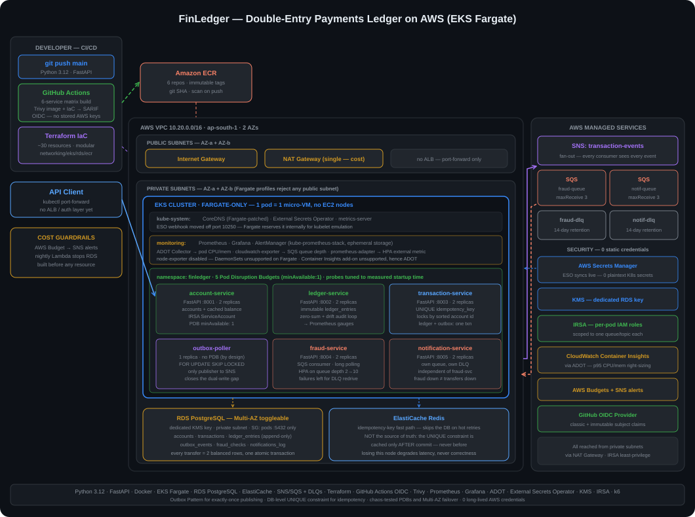

# FinLedger

[](LICENSE)
[](https://python.org)
[](https://terraform.io)
[](https://kubernetes.io)
[](https://aws.amazon.com)

A production-shaped double-entry payments ledger built on AWS EKS — from a design doc through async event processing, security hardening, chaos testing, and cost optimization. Built as a portfolio project targeting backend/cloud engineering roles at GCCs (Global Capability Centers) in the Mumbai/Pune banking corridor.

**Live architecture:** 6 FastAPI microservices → EKS (Fargate) → RDS PostgreSQL (Multi-AZ toggleable) → SNS/SQS async pipeline → Prometheus/Grafana → GitHub Actions CI/CD with OIDC and Trivy scanning → External Secrets Operator

> **This is not a tutorial project, and it isn't finished either — both of those are stated directly rather than smoothed over.** Every phase ran against real AWS infrastructure and hit real, non-obvious production bugs — a Helm chart silently colliding with a port Fargate reserves for itself, a crash loop that looked like slow startup but was actually a memory ceiling, a stale ConfigMap that Helm itself was misreporting. The [Notable Engineering Challenges](#notable-engineering-challenges-solved) section documents what actually broke and how it was diagnosed. The project also isn't fully complete: the AWS account was suspended mid-way through the final load-testing phase, for the same underlying reason as an earlier account before it — see the status note and [Known Limitations](#known-limitations).

---

## Table of Contents

- [Architecture](#architecture)
- [Tech Stack](#tech-stack)
- [Project Structure](#project-structure)
- [Build Journey](#build-journey)
- [Notable Engineering Challenges Solved](#notable-engineering-challenges-solved)
- [Key Numbers](#key-numbers)
- [Getting Started](#getting-started)
- [Known Limitations](#known-limitations)
- [What I Would Do Next](#what-i-would-do-next)
- [Checkpoints Reached](#checkpoints-reached)

---

## Architecture



**Request flow:** API client → `transaction-service` (writes ledger entries + an outbox row in one DB transaction) → `outbox-poller` (the only thing that ever talks to SNS) → fan-out to `fraud-service` and `notification-service` via independent SQS queues, each backed by its own DLQ.

**Why these choices, briefly:**
- **Postgres, not a NoSQL store** — the ledger's correctness guarantee needs multi-row ACID transactions (a transfer writes two balanced ledger rows atomically), not per-item consistency.
- **The Outbox Pattern** — writing to Postgres and publishing to SNS can never be one atomic operation across two systems. `transaction-service` writes an `outbox_events` row in the *same* transaction as the ledger entries; a separate poller is the only thing that ever touches SNS, closing the dual-write gap.
- **SNS fan-out, not a shared queue** — fraud-check and notification each need to see *every* event independently; a shared queue means one consumer's message is gone before the other sees it.
- **IRSA everywhere a pod touches AWS** — every service calling SQS, SNS, Secrets Manager, or CloudWatch does so via a scoped IAM role bound to its own Kubernetes ServiceAccount, never a static key.

---

## Tech Stack

| Layer | Tool | Why |
|---|---|---|
| Application | FastAPI (Python 3.12) | Async-native REST APIs, Pydantic validation |
| Database | RDS PostgreSQL | Multi-AZ toggleable via Terraform var; encrypted with a dedicated KMS key |
| Cache | ElastiCache Redis | Fast-path idempotency-key lookups ahead of the DB-level `UNIQUE` constraint |
| Messaging | SNS (fan-out) + SQS (with DLQs) | Independent delivery per consumer; poison messages provably land in the DLQ, not silently dropped |
| Containers | Docker | Per-service Dockerfiles, `python:3.12-slim` base, OS packages patched at build time |
| Orchestration | Amazon EKS (Fargate-only) | Serverless Kubernetes — every pod is its own micro-VM, no EC2 node management |
| IaC | Terraform | Modular: networking / eks / rds / elasticache / ecr, applied per phase |
| CI/CD | GitHub Actions + OIDC | Matrix build across 6 services, Trivy image + Terraform config scanning, SARIF to the Security tab |
| Observability | Prometheus, Grafana, AlertManager | ADOT Collector for pod-level Container Insights; `yet-another-cloudwatch-exporter` for SQS queue depth |
| Security | External Secrets Operator, KMS, IRSA | DB credentials synced live from Secrets Manager, never a static Kubernetes Secret typed by hand |
| Reliability | Pod Disruption Budgets, tuned probes, HPA | HPA driven off a real external SQS metric via `prometheus-adapter`, not just CPU |
| Testing | pytest, k6 | Concurrent idempotency proof, poison-message-to-DLQ proof, load testing |

---

## Project Structure

```
finledger/
├── guardrails/terraform/     # Cost guardrails — budget alerts, auto-shutdown Lambda (Phase 0)
├── core-services/            # account-service, ledger-service, transaction-service (Phase 2)
├── infrastructure/           # VPC, EKS Fargate, RDS, ElastiCache, ECR (Phase 4)
├── ci-cd/                    # GitHub Actions OIDC, Trivy scanning, deploy workflow (Phase 5)
├── async/                    # outbox-poller, fraud-service, notification-service (Phase 6)
├──observability/             # kube-prometheus-stack via Helm and two AWS-specific bridges (Phase 7)
├── reliability/              # Pod Disruption Budgets, probe tuning, chaos experiments (Phase 9)
├── security/                 # External Secrets Operator, KMS (Phase 8)
├── cost-optimization/        # ADOT Container Insights, right-sizing (Phase 10)
├── load-testing/             # k6 scripts, HPA on SQS depth, breaking-point report (Phase 11)
└── .github/workflows/        # CI/CD pipeline definition
```

---

## Build Journey

### Step 1 — Core Services & the Ledger Design

Three FastAPI services sharing one Postgres schema: `account-service`, `ledger-service`, `transaction-service`. Every transfer writes two balanced double-entry rows (`ledger_entries`, debit + credit) inside a single DB transaction, guarded by a real `UNIQUE` constraint on `idempotency_key` — proven with a genuinely *concurrent* retry test (two identical requests fired via a thread pool at once), not just a sequential resend.

### Step 2 — Containerization

Per-service Dockerfiles on `python:3.12-slim`, with an explicit `apt-get upgrade` layer added after Trivy caught real, fixable CVEs in the base image's OS packages — kept permanently as a hardening step, not just a one-time fix.

### Step 3 — Infrastructure as Code (Terraform)

Modular Terraform: `networking`, `eks`, `rds`, `elasticache`, `ecr`. EKS runs Fargate-only — no EC2 node groups, no Auto Scaling Group quotas to manage, at the cost of several Fargate-specific constraints documented below.

### Step 4 — Cost Guardrails (built first, deliberately)

Before any billable resource existed: an SNS-backed AWS Budget alert and a nightly Lambda that stops RDS automatically, restarting it each morning. This ran *before* Phase 1's design work even started — cost discipline as a precondition, not an afterthought.

### Step 5 — CI/CD Pipeline (GitHub Actions)

```
┌──────────────────────────────────────────────────────────┐
│  build-scan-push-deploy  (matrix: 6 services, parallel)  │
│                                                            │
│  • docker build per service                               │
│  • Trivy scan — exit 1 on HIGH/CRITICAL, ignore-unfixed   │
│  • Trivy SARIF → GitHub Security tab                       │
│  • docker push → ECR, tagged with the git SHA              │
│  • kubectl set image + rollout status per service          │
└──────────────────────────────┬───────────────────────────┘
                                │
┌──────────────────────────────▼───────────────────────────┐
│  scan-terraform                                            │
│  • Trivy config scan across every .tf file → Security tab  │
└─────────────────────────────────────────────────────────────┘
```

Authenticates via GitHub OIDC — no long-lived `AWS_ACCESS_KEY_ID` stored anywhere. The trust policy is scoped to the exact repo and branch, and to both the classic and GitHub's newer immutable OIDC subject-claim formats (verified against GitHub's own changelog, not assumed).

### Step 6 — Async Decoupling (the Outbox Pattern)

`outbox-poller` reads `outbox_events` with `FOR UPDATE SKIP LOCKED` — safe to scale to multiple replicas with zero coordination logic, though it runs as one replica at this traffic level — and publishes to SNS, which fans out to independent `fraud-service` and `notification-service` queues, each with its own DLQ. A poison-message test proves a bad message survives real SQS retries and visibility timeouts before landing in the DLQ — not a mocked wait.

### Step 7 — Observability

`kube-prometheus-stack` via Helm, plus two AWS-specific bridges: the ADOT Collector for pod-level CPU/memory (Container Insights doesn't support the newer, easier `amazon-cloudwatch-observability` add-on on Fargate — confirmed against AWS's own docs), and `yet-another-cloudwatch-exporter` for SQS queue depth, since that's an AWS-side fact no Kubernetes-native exporter can see.

### Step 8 — Security Hardening

External Secrets Operator syncing `finledger-db-credentials` live from AWS Secrets Manager — no plaintext credential typed into a Kubernetes Secret by hand after this point. RDS encrypted with a dedicated KMS key. IRSA scoped per-service, least-privilege throughout.

### Step 9 — Reliability & Chaos Engineering

Pod Disruption Budgets (`minAvailable: 1`) on every 2-replica service, tuned `startupProbe`/`readinessProbe`/`livenessProbe` timing per service's real measured startup time, then tested for real: two Fargate nodes drained back-to-back, once with PDB protection (the second eviction genuinely blocked and retried until safe) and once without (real, measured downtime) — an actual before/after comparison, not an assumed one.

### Step 10 — Cost Optimization

ADOT-collected p95 CPU/memory data feeding a right-sizing methodology: sized for the worst-observed replica plus headroom, not the average — the difference between a recommendation that's safe under real variance and one that only looks good on paper.

### Step 11 — Load Testing & Autoscaling (in progress)

An HPA driven by a real external metric — SQS queue depth via `prometheus-adapter`, wired through the External Metrics API — rather than CPU alone, since queue depth is what actually signals `fraud-service` needs to scale. 100 independent pre-funded accounts seeded specifically so a k6 load test spreads row-lock contention realistically instead of measuring two accounts' lock serialization. The stated hypothesis going in: Phase 2's connection-per-request pattern (no pooling, flagged as a known limitation since it was written) would be the actual bottleneck before CPU or memory. This is the phase that was interrupted — see Known Limitations.

---

## Notable Engineering Challenges Solved

Anyone can follow a tutorial to a green checkmark. What's harder to fake is a long list of *specific, non-obvious* bugs actually found and fixed, each with a real diagnosed root cause rather than a guess that happened to work:

### 1. EKS Fargate's private-subnet requirement

Fargate profiles silently reject any subnet list containing a public subnet. The natural-looking `vpc_config.subnet_ids` on an EKS cluster includes both — hit this twice, in two different phases, each time fixed by explicitly filtering to subnets tagged `kubernetes.io/role/internal-elb`.

### 2. A Helm chart colliding with Fargate's reserved port

External Secrets Operator's webhook defaulted to port 10250 — the exact port Fargate reserves internally for its own kubelet-emulation endpoint on every pod. The resulting TLS certificate error looked like a webhook misconfiguration; the real cause was Fargate's own internal endpoint silently answering instead of the actual webhook container. Fixed by moving the webhook to a non-conflicting port.

### 3. OOMKilled disguised as a slow-startup problem

`prometheus-adapter` crash-looped for hours with liveness-probe timeouts that looked exactly like "the app takes too long to start." The real cause, buried in `kubectl describe pod`: `Reason: OOMKilled`. The chart shipped with no default memory limit, and Fargate's fallback (0.5GB) was too small for the adapter's startup metrics relist against Prometheus.

### 4. A stale ConfigMap that Helm itself was misreporting

A Helm release sat on revision 1 for days while `helm get values` reported a corrected config that was never actually rendered into the live ConfigMap — the running pod was reading a completely different config than what Helm claimed. Root cause: the values file used the wrong top-level key entirely (a flat `metrics:`/`region:` structure instead of the chart's real schema, a single `config:` key holding a raw YAML string) — silently ignored rather than erroring, so nothing ever pointed at the actual mismatch except reading the chart's real default `values.yaml` directly.

### 5. GitOps drift between committed YAML and the live cluster

CI's `kubectl set image` patches the running Deployment directly but never touches the committed manifest. Re-applying that stale manifest later (for an unrelated change, like adding a rollout strategy) silently reverted a working deployment back to a placeholder image tag that no longer existed in ECR.

### 6. A PowerShell encoding trap that corrupted a source file

`>>` redirection on Windows PowerShell defaults to UTF-16LE, embedding a null byte between every character. A one-line "trigger CI" comment silently corrupted a Python file into one that failed to import — with an error (`SyntaxError: source code string cannot contain null bytes`) that gave no hint the cause was a shell redirection choice made minutes earlier.

### 7. Fargate vCPU quota exhaustion, twice, for different reasons

Once from ordinary rolling-deploy surge capacity across six services updating at once (fixed with `maxSurge: 0`); once from a single monitoring pod requesting a full vCPU on a cluster sized for a fraction of that (fixed by right-sizing the pod itself — a fitting bug to hit during the cost-optimization phase specifically).

### 8. GitHub's immutable OIDC subject-claim rollout

Verified against GitHub's own changelog — not assumed — that repositories created after July 15, 2026 get a new `owner@id/repo@id` subject-claim format. Tightened the CI role's IAM trust policy to match both the classic and new formats precisely, instead of a broad wildcard that would have also matched unrelated, similarly-named repos.

### 9. Two full AWS-account migrations mid-project

Two separate AWS Free Plan accounts were suspended after running real infrastructure without staying on top of the credit balance. Each migration meant re-running every phase's Terraform against a clean account, re-seeding data, re-pushing every image, and re-learning — concretely, not abstractly — why Phase 0's cost guardrails existed in the first place.

---

## Key Numbers

| Metric | Value |
|---|---|
| Microservices | 6 (account, ledger, transaction, fraud, notification, outbox-poller) |
| Terraform-managed AWS resources (Phase 4 core stack) | ~30 |
| CI/CD pipeline jobs per push | 2 (6-way service matrix + Terraform config scan) |
| Pod Disruption Budgets | 5 (all 2-replica services; outbox-poller intentionally excluded) |
| SQS Dead Letter Queues | 2 (fraud, notification) |
| pytest suites | 4 (sequential idempotency, concurrent idempotency, poison-to-DLQ ×2) |
| Real production bugs diagnosed and fixed | 9+ (documented above) |
| AWS accounts exhausted over the project's life | 2 |
| Plaintext secrets in the repository | 0 |
| Long-lived AWS credentials stored anywhere | 0 |

---

## Getting Started

### Prerequisites

- AWS account with configured CLI (`aws configure`)
- Terraform ≥ 1.6
- kubectl + Helm 3
- Docker Desktop

### Run locally (no AWS required)

```bash
git clone https://github.com/saurabhg4356/finledger.git
cd finledger/core-services
docker-compose up -d --build

curl http://localhost:8001/healthz   # account-service
curl http://localhost:8002/healthz   # ledger-service
curl http://localhost:8003/healthz   # transaction-service
```

### Deploy to AWS (full stack)

```bash
# 1. Cost guardrails FIRST, in any account this touches
cd guardrails/terraform
terraform init && terraform apply -var="alert_email=you@example.com"

# 2. Core infrastructure — VPC, EKS Fargate, RDS, ElastiCache, ECR
cd ../../infrastructure/terraform
terraform init && terraform apply

# 3. Connect kubectl, patch CoreDNS for Fargate
aws eks update-kubeconfig --name finledger-cluster --region ap-south-1
kubectl patch deployment coredns -n kube-system --type json \
  -p '[{"op":"remove","path":"/spec/template/metadata/annotations/eks.amazonaws.com~1compute-type"}]'

# 4. Build + push all 6 service images, then apply k8s manifests
#    (see ci-cd/ and async/ for per-service Dockerfiles and manifests)

# 5. CI/CD — OIDC role + Trivy-gated pipeline
cd ../../ci-cd/terraform
terraform init && terraform apply

# 6. Security — External Secrets Operator syncing from Secrets Manager
helm install external-secrets external-secrets/external-secrets -n finledger

# 7. Reliability — Pod Disruption Budgets
kubectl apply -f reliability/k8s/pod-disruption-budgets.yaml

# 8. Observability — kube-prometheus-stack + ADOT + cloudwatch-exporter
helm install kube-prometheus-stack prometheus-community/kube-prometheus-stack -n monitoring
```

### Access Grafana (port-forward)

```bash
kubectl port-forward -n monitoring svc/kube-prometheus-stack-grafana 3000:80
# open http://localhost:3000
```

---

## Known Limitations

Stated directly, the way every phase in this project tried to state its own gaps rather than hide them:

- **Phase 11's load-test and HPA-scaling results are methodology only, not filled-in real data.** The k6 script, the 100-account seeded load-test dataset, and the HPA wired to real SQS queue depth are all built — the external metric was confirmed flowing end-to-end from CloudWatch through Prometheus to the Kubernetes External Metrics API — before the AWS account was suspended mid-experiment.
- **No authentication/authorization layer.** Every service trusts its caller. A real bank-grade system needs this before anything else; flagged honestly rather than bolted on superficially.
- **Connection-per-request, no pooling**, in every service — a known, named scaling limit since Phase 2, and the specific bottleneck Phase 11's load test was designed to confirm or refute.
- **Two AWS accounts were suspended over the life of this project**, both for the same underlying reason: real infrastructure left running against a free-credit plan without staying on top of the balance.

---

## What I Would Do Next

- **Fill in Phase 11's real numbers** against a fresh account — the tooling is fully built and waiting
- **Add an auth layer** (JWT or an API gateway with Cognito) before anything resembling production readiness
- **Connection pooling** (PgBouncer or an app-level pool) — Phase 11's stated hypothesis, worth confirming with real load
- **ArgoCD** for pull-based GitOps deploys, closing the exact drift gap that caused Challenge #5 above
- **A DynamoDB or Postgres-native audit log table**, considered in the Phase 1 design doc and never built
- **WAF on an ALB/Ingress**, once real public traffic is in scope

---

## Checkpoints Reached

- [x] Double-entry ledger with proven idempotency under concurrent retries
- [x] Full async pipeline — Outbox Pattern, SNS fan-out, SQS with DLQs — poison-message handling proven against real SQS retries
- [x] CI/CD: 6-service matrix build, Trivy image + IaC scanning to the Security tab, OIDC auth with zero stored AWS keys
- [x] External Secrets Operator syncing live from Secrets Manager — zero plaintext credentials after Phase 8
- [x] Pod Disruption Budgets tested for real via back-to-back node drains, with a measured before/after
- [x] RDS Multi-AZ failover toggle wired and exercised
- [x] Cost guardrails live *before* Phase 1 even started; two real account exhaustions since, both recovered from
- [x] ADOT + CloudWatch Exporter feeding Prometheus/Grafana with real pod and SQS metrics
- [x] HPA wired to a real external SQS metric, confirmed flowing end-to-end
- [ ] Load test executed with real, filled-in breaking-point numbers (interrupted by account suspension)

---

*Built by [Saurabh Gupta](https://github.com/saurabhg4356) as an end-to-end backend/cloud engineering project — from a double-entry ledger design doc to a chaos-tested, cost-optimized system on AWS EKS.*
